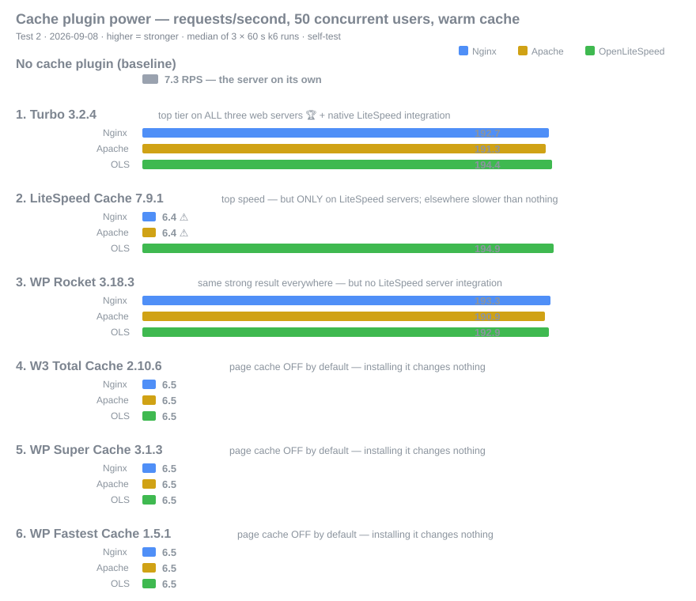

<div dir="rtl">

# اختبار أداء إضافات التخزين المؤقت لووردبريس

[🇬🇧 English](README.md) · [🇮🇷 فارسی](README.fa.md) · **🇸🇦 العربية**

اختبار أداء مفتوح وقابل لإعادة الإنتاج لإضافات الكاش في ووردبريس — **Turbo وLiteSpeed Cache وWP Rocket وW3 Total Cache وWP Super Cache وWP Fastest Cache** — على **ثلاثة خوادم ويب**: Nginx وApache وOpenLiteSpeed.

جميع السكربتات والإعدادات والبيانات الخام منشورة في هذا المستودع. تشك في رقم؟ أعد تشغيله بنفسك.

<div dir="ltr">



</div>

**الحالة: 🚧 الجولة الأولى قيد التنفيذ** — خط الأساس ✅ · LiteSpeed Cache ✅ · WP Rocket ✅ · Turbo ✅ · الإضافات المجانية الثلاث (كما هي) ✅ · تشغيلات «الإعدادات المفعّلة» وإعادة القياس الخارجي: في قائمة الانتظار.

## إصدارات الاختبار

الإضافات تتحدّث والخوادم تتحدّث — الاختبار لقطة زمنية وليس حقيقة أبدية. لذلك تُنشر النتائج على شكل **جولات (Rounds)**:

- **الجولة الأولى — `2026-09`** (الحالية): إصدارات المكوّنات مثبّتة في الجدول أدناه، وكل مجلد نتائج يحمل معرّف الجولة، وعند اكتمالها تحصل على وسم `round-1`.
- الجولات القادمة تعيد السيناريوهات نفسها بمكوّنات محدّثة وجدول إصدارات خاص بها، ليكون التحسّن (أو التراجع) في كل تحديث قابلاً للتتبّع. هذه هي الطريقة الأكثر إنصافاً للمقارنة.

## بيئة الاختبار (مقاسة، لا مزعومة)

خادم الاختبار مقدَّم من **[FamaServer](https://famaserver.com)** — خادم افتراضي معزول مخصص لهذا الاختبار، بدون لوحة تحكم وبدون أي أحمال أخرى.

| المكوّن | القيمة |
|---|---|
| المزوّد | FamaServer — خادم مخصص للاختبار |
| المعالج | Intel Xeon Gold 6138 @ 2.00GHz — 4 أنوية افتراضية (VMware) |
| الذاكرة | 8 جيجابايت |
| القرص | 40GB NVMe — **مُقاس بـ fio**: 87.9k IOPS قراءة عشوائية 4k، 64.4k IOPS كتابة، 1.47GB/s قراءة تسلسلية |
| الشبكة | ~130/160 ميجابت دولي؛ اختبارات الحمل من جهاز في نفس مركز البيانات |
| نظام التشغيل | Ubuntu 24.04.4 LTS |
| PHP | 8.2 (FPM ثابت، 12 عامل، OPcache 256MB — حدود متطابقة على كل المنصات) |
| قاعدة البيانات | MariaDB 10.11.14 مع buffer pool بحجم 2G — إعداد ثابت لكل تشغيل |
| TLS | Let's Encrypt مع HTTP/2 |

### الإصدارات قيد الاختبار — الجولة الأولى (2026-09)

| المكوّن | الإصدار | | المكوّن | الإصدار |
|---|---|---|---|---|
| ووردبريس | 7.1 | | LiteSpeed Cache | 7.9.1 |
| WooCommerce | 9.9.5 | | WP Rocket | 3.18.3 |
| قالب Woodmart | 8.2.6 | | **Turbo** | **3.1.3** |
| Elementor | 3.30.2 | | W3 Total Cache | 2.10.6 |
| Nginx | 1.24.0 | | WP Super Cache | 3.1.3 |
| Apache | 2.4.58 (event) | | WP Fastest Cache | 1.5.1 |
| OpenLiteSpeed | 1.9.2 | | k6 (أداة الحمل) | 2.2.0 |

محتوى الموقع: **830 منتجاً، 109 مقالة، 234 طلباً** (ديمو Woodmart + WC Smooth Generator).

## السيناريوهات

| # | السيناريو | المقياس |
|---|---|---|
| S1 | كاش بارد — أول زيارة بعد التفريغ ×5 دورات | TTFB |
| S2 | كاش دافئ — 15 طلباً متتالياً | وسيط TTFB / p95 |
| S3–S5 | 50 / 200 / 500 مستخدم متزامن × 3+ تكرارات (k6) | RPS، TTFB p50/p95، نسبة الأخطاء، CPU |
| S6 | مستخدم مسجّل / سلة ممتلئة (تجاوز الكاش) | TTFB p50/p95 |
| S7 | سرعة التفريغ بعد تعديل منتج | ثوانٍ، CPU |

## النتائج — الجولة الأولى (حتى الآن)

### خط الأساس — بدون إضافة كاش (اختبار داخلي¹، 50 مستخدماً)

| خادم الويب | RPS | TTFB p50 | TTFB p95 | أخطاء |
|---|---|---|---|---|
| Nginx | 7.4 | 6,420ms | 7,019ms | 0% |
| OpenLiteSpeed | 7.3 | 6,445ms | 7,049ms | 0% |
| Apache | 7.3 | 6,497ms | 7,130ms | 0% |

بدون كاش، عنق الزجاجة هو PHP/CPU — اختيار خادم الويب لا يغيّر شيئاً (فرق أقل من 1.5٪).

### LiteSpeed Cache 7.9.1 — الإعدادات الافتراضية (اختبار داخلي¹، 50 مستخدماً، كاش دافئ)

| خادم الويب | RPS | TTFB p50 | مقارنة بخط الأساس |
|---|---|---|---|
| **OpenLiteSpeed** | **194.9** | **0.4ms** | **×26.7** |
| Nginx | 6.4 | 7,383ms | ×0.87 — *أبطأ من بدون إضافة* |
| Apache | 6.4 | 7,359ms | ×0.87 — *أبطأ من بدون إضافة* |

على خادمه الخاص التحوّل هائل؛ على Nginx/Apache كاش الصفحات معطّل والإضافة عبء خالص.

### WP Rocket 3.18.3 — الإعدادات الافتراضية (اختبار داخلي¹، 50 مستخدماً، كاش دافئ)

| خادم الويب | RPS | TTFB p50 | مقارنة بخط الأساس |
|---|---|---|---|
| Nginx | **193.3** | 1.8ms | ×26.1 |
| OpenLiteSpeed | **192.9** | 2.1ms | ×26.4 |
| Apache | **190.9** | 2.3ms | ×26.2 |

مستقل عن خادم الويب: النتائج متطابقة إحصائياً على المنصات الثلاث. تشغيله الأول أُلغي بواسطة بوابة التحقق لدينا (تلوث كاش قديم) — التفاصيل في [`results/ROCKET-default-selftest.md`](results/ROCKET-default-selftest.md).

### Turbo 3.1.3 — بإعدادات المطوّر الكاملة (اختبار داخلي¹، 50 مستخدماً، كاش دافئ)

| خادم الويب | RPS | TTFB p50 | مقارنة بخط الأساس |
|---|---|---|---|
| **OpenLiteSpeed** | **193.9** | **0.4ms** | ×26.6 |
| Nginx | 12.3 | 3,750ms | ×1.7 |
| Apache | 12.2 | 3,760ms | ×1.7 |

على OpenLiteSpeed يضاهي Turbo إضافة LiteSpeed Cache عبر تكامل أصيل مع كاش الخادم (تم التحقق بدورة miss←hit مع وسومه الخاصة `turbo_*`). على Nginx/Apache يعمل الكاش (`x-turbo-cache: HIT`) لكن كل إصابة تمرّ عبر إقلاع ووردبريس الكامل — بدون `advanced-cache.php` — فيبقى السقف ~12 RPS. التفاصيل: [`results/TURBO-configured-selftest.md`](results/TURBO-configured-selftest.md)

### الإضافات المجانية الثلاث — كما هي بعد التفعيل

الثلاث عند خط الأساس تماماً (~6.5 RPS): **كاش الصفحات لا يعمل أبداً حتى يُفعَّل من الإعدادات.** التفاصيل: [`results/FREE3-outofbox-selftest.md`](results/FREE3-outofbox-selftest.md)

> ¹ *اختبار داخلي* أي أن k6 عمل على الخادم الهدف نفسه. الأرقام النهائية ستُعاد من جهاز منفصل.

## قواعد الإنصاف

١. كاش صفحات LSCache يعمل فقط على خوادم LiteSpeed — نتائجه على غيرها تُعرض منفصلة ومع السياق.
٢. كل إضافة تُختبر مرتين: **الإعدادات الافتراضية** و**الإعدادات الموصى بها رسمياً** (مع تفعيل التحميل المسبق حيث يُنصح به). تصدير الإعدادات يُنشر مع كل نتيجة.
٣. Turbo يُختبر بالوضعين نفسيهما — لا ضبط خفي.
٤. بين كل تغيير: تفريغ كامل ← إعادة تشغيل PHP ← ثلاث جولات إحماء.
٥. ترويسات الاستجابة تُحفظ كدليل على إصابة/تفويت الكاش.
٦. إصدارات المكوّنات مثبّتة ومنشورة لكل جولة.

## إعادة الإنتاج

<div dir="ltr">

```bash
bash scripts/provision/01-base.sh <your-domain>
bash scripts/provision/03a-nginx.sh <your-domain>
bash scripts/provision/03c-apache.sh <your-domain>
bash scripts/provision/03b-openlitespeed.sh <your-domain>
bash scripts/bench/plugin-bench.sh <plugin-slug> <label>
python3 scripts/bench/summarize.py results/<run-dir>/
```

</div>

## الترخيص

السكربتات والوثائق: MIT. البيانات الخام: CC BY 4.0 — مع ذكر المصدر.

</div>
