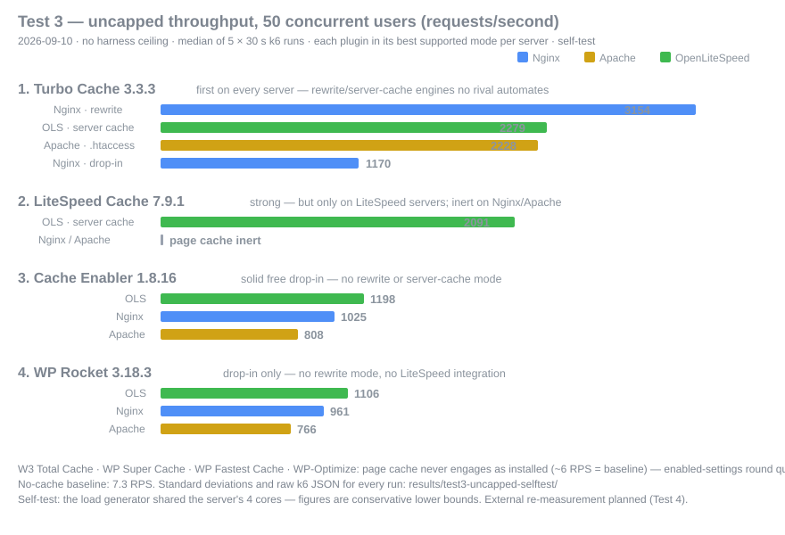

<div dir="rtl" align="right">

# بنچمارک افزونه‌های کش وردپرس

[🇬🇧 English](README.md) · **🇮🇷 فارسی** · [🇸🇦 العربية](README.ar.md)

بنچمارک باز و قابل‌تکرار افزونه‌های کش وردپرس روی سه وب‌سرور Nginx، Apache و OpenLiteSpeed.
تمامی اسکریپت‌ها، تنظیمات و داده‌های خام در همین مخزن منتشر شده و اسکریپت اجراکننده‌ی دقیق نیز ضمیمه است تا هر عددی را خودتان بازتولید کنید.

## 🏆 رتبه‌بندی کلی — تست ۳ (۱۹ شهریور ۱۴۰۵ / 2026-09-10)

معیار: بیشینه‌ی توان تأییدشده، هر افزونه در بهترین حالتی که پشتیبانی می‌کند (جدول‌های تفکیکی پایین — Turbo Cache روی **تک‌تک وب‌سرورها** نیز رتبه‌ی نخست است):

| رتبه | افزونه | بیشینه RPS (۵۰ کاربر) | حالت |
|---|---|---|---|
| 🥇 | **[Turbo Cache](https://www.zhaket.com/web/turbo-plugin) 3.3.3** | **۳,۱۵۴** | قوانین rewrite در Nginx — سرو کش بدون PHP |
| 🥈 | LiteSpeed Cache 7.9.1 | ۲,۰۹۱ | کش سرور LiteSpeed (فقط OLS) |
| 🥉 | Cache Enabler 1.8.16 | ۱,۱۹۸ | drop-in ‏PHP (روی OLS) |
| ۴ | WP Rocket 3.18.3 | ۱,۱۰۶ | drop-in ‏PHP (روی OLS) |

<div dir="ltr" align="left">




</div>

## تست ۳ — چه چیزی سنجیده شد

محیط همان است ([سرور مجازی](https://famaserver.com/vps/) فاماسرور · ۴ هسته Xeon Gold 6138 · ۸GB · NVMe · Ubuntu 24.04 · PHP 8.2 با ۱۲ ورکر روی هر سه استک · MariaDB · Redis · وردپرس + ووکامرس + Woodmart با ۸۳۰ محصول). ارتقاهای پروتکل نسبت به تست ۱/۲ — شرح کامل در [گزارش تفصیلی](results/TEST3-uncapped-selftest.md):

- **k6 بدون sleep بین درخواست‌ها** — سناریوی تست ۱/۲ همه‌ی افزونه‌های سریع را در سقف ~۱۹۸ RPS نگه می‌داشت؛ با حذف سقف، «رده‌ی ~۱۹۲» به بازه‌ی ۷۶۶ تا ۳,۱۵۴ باز شد.
- **دروازه‌ی زنده‌بودن کش** پیش از هر بلوک اندازه‌گیری (یک اجرای اولیه که بی‌صدا کشِ مرده را سنجیده بود کنار گذاشته شد — این دروازه برای همان ساخته شد که دیگر هرگز تکرار نشود).
- **کش سرد = فقط purge کش صفحه** (بدون فلاش object cache — هیچ رقیبی object cache نصب نمی‌کند، پس فلاش Redis فقط به Turbo Cache هزینه تحمیل می‌کرد).
- تنظیم یکسان Apache برای همه‌ی افزونه‌ها؛ ۵ اجرای ۳۰ ثانیه‌ای در ۵۰ کاربر و ۳ اجرا در ۲۰۰ کاربر؛ میانه **به‌همراه انحراف معیار** منتشر شده است.

### افزونه‌های تحت تست

| ردیف | افزونه | ورژن | نوع |
|---|---|---|---|
| ۱ | [Turbo Cache](https://www.zhaket.com/web/turbo-plugin) | 3.3.3 | تجاری |
| ۲ | LiteSpeed Cache | 7.9.1 | رایگان |
| ۳ | WP Rocket | 3.18.3 | تجاری |
| ۴ | Cache Enabler | 1.8.16 | رایگان |
| ۵ | W3 Total Cache | 2.10.6 | رایگان |
| ۶ | WP Super Cache | 3.1.3 | رایگان |
| ۷ | WP Fastest Cache | 1.5.1 | رایگان |
| ۸ | WP-Optimize | 4.6.1 | رایگان |

ابزار مکمل (کش صفحه‌ای نیست): Cache Warmer 1.3.10

### نتایج — ۵۰ کاربر همزمان، کش گرم (میانه ± انحراف معیار)

| افزونه | Nginx | Apache | OpenLiteSpeed |
|---|---|---|---|
| **Turbo Cache — بهترین حالت** | **۳,۱۵۴ ± ۳۳۶** (rewrite) | **۲,۲۲۸ ± ۲۶** (.htaccess) | **۲,۲۷۹ ± ۲۱** (کش سرور) |
| Turbo Cache — ‏drop-in | ۱,۱۷۰ ± ۱۷ | ۸۴۷ ± ۲۵ | — |
| LiteSpeed Cache | غیرفعال | غیرفعال | ۲,۰۹۱ ± ۱۳ |
| Cache Enabler | ۱,۰۲۵ ± ۸۸ | ۸۰۸ ± ۶۳ | ۱,۱۹۸ ± ۹ |
| WP Rocket | ۹۶۱ ± ۱۷ | ۷۶۶ ± ۵ | ۱,۱۰۶ ± ۷ |
| *(بدون کش)* | *۷.۴* | *۷.۳* | *۷.۳* |

چهار افزونه‌ی W3 Total Cache، WP Super Cache، WP Fastest Cache و WP-Optimize با کش خاموش عرضه می‌شوند (تست ۲) و از این دور خارج‌اند؛ دور «تنظیمات فعال» در صف است. جدول ۲۰۰ کاربر، چرخه‌های کش سرد و مدارک هدرها: [گزارش تفصیلی](results/TEST3-uncapped-selftest.md).

### تست ۳ چه چیزی را ثابت کرد

**۱ — Turbo Cache روی هر سه وب‌سرور رتبه‌ی نخست است:** ‏+۲۲٪ نسبت به WP Rocket در کلاس drop-in روی Nginx (۱,۱۷۰ در برابر ۹۶۱)، +۹٪ نسبت به LiteSpeed Cache روی سرور خودِ لایت‌اسپید (۲,۲۷۹ در برابر ۲,۰۹۱)، و ۲.۳ تا ۳.۳ برابرِ همه‌ی رقبا در حالت‌های rewrite.

**۲ — Turbo Cache تنها افزونه‌ای است که سرو سطح وب‌سرور را روی هر سه سرور خودکار کرده:** قوانین تولیدشده‌ی nginx، بلاک خودکار `.htaccess` و یکپارچگی بومی با کش سرور LiteSpeed (‏sidecar تگ‌ها، راستی‌آزمایی miss←hit). WP Rocket هیچ‌کدام را ندارد؛ LiteSpeed Cache فقط روی لایت‌اسپید کار می‌کند.

**۳ — کش سرد اکنون با WP Rocket برابر است** (~۱.۰۶ ثانیه اولین بازدید بعد از purge): از 3.3.3 بازدید اول HTML خام را فوری می‌گیرد و بهینه‌سازی در پس‌زمینه جایگزین فایل کش می‌شود.

**۴ — هر ادعا با هدر مستند است:** `x-turbo-cache-engine: nginx | htaccess | dropin` و چرخه‌ی `x-litespeed-cache: miss←hit`، ضبط‌شده برای هر زمین و منتشرشده کنار داده خام.

### دو عدد TTFB را با هم اشتباه نگیرید

**پروب تک‌درخواست** (~۱۳۰ms گرم) هندشیک TLS خودِ پروب را هم شامل است — عددی مقایسه‌ای است، نه تأخیر کاربر نهایی. **p50 تست بار** (۷ تا ۵۰ms) زمان پاسخ سمت سرور زیر همزمانی است. هر دو منتشر شده‌اند؛ دو چیز متفاوت را می‌سنجند.

### خودتان راستی‌آزمایی کنید

<div dir="ltr" align="left">

```bash
bash scripts/provision/01-base.sh <your-domain>
bash scripts/bench/test3-run.sh turbo turbo   # یا wp-rocket، cache-enabler، ...
python3 scripts/bench/summarize.py results-test3/
```

</div>

سایت آزمایش یک فروشگاه واقعی است؛ تمام JSONهای خام k6، لاگ‌های CPU و هدرهای ضبط‌شده در [`results/`](results/) موجود است.

### آرشیو آزمون‌ها

تمام دورهای پیشین با مشخصات کامل محیط، گزارش‌ها و داده خام، به‌صورت دائمی در دسترس است: **[results/ — آرشیو آزمون‌ها](results/README.md)** (تگ‌های گیت `test-1`، `test-2`، `test-3`). هر گزارش با جدول کامل «مشخصات محیط و پیش‌نیازها» آغاز می‌شود: سخت‌افزار سرور با کارایی اندازه‌گیری‌شده‌ی دیسک، نسخه‌ی دقیق سیستم‌عامل و PHP و پایگاه‌داده و وب‌سرورها، قالب و تعداد محصولات و نوشته‌ها، و ورژن دقیق افزونه‌های همان دور.

### رصد پیشرفت

| تست | تاریخ | Turbo Cache | نتیجه شاخص | وضعیت |
|---|---|---|---|---|
| تست ۱ | ۱۴۰۵/۰۶/۱۷ | 3.1.3 | ۱۲ RPS روی Nginx (بدون موتور drop-in) | ✅ `test-1` |
| تست ۲ | ۱۴۰۵/۰۶/۱۷ | 3.2.4 | ~۱۹۲ RPS (رده‌ی محدود به سقف ابزار) | ✅ `test-2` |
| **تست ۳** | **۱۴۰۵/۰۶/۱۹** | **3.3.3** | **۳,۱۵۴ RPS بدون سقف — نخست روی هر سه سرور** | ✅ `test-3` |
| تست ۴ | — | — | مولد بار خارجی، ۵۰۰ کاربر، دور «تنظیمات فعال»، دور فرانت‌اند | 🔜 |

### محدودیت‌ها

تست داخلی (مولد بار روی همان ۴ هسته — اعداد کران پایینِ محافظه‌کارانه‌اند)؛ یک پروفایل سخت‌افزاری؛ بدون CDN؛ ‏TTFB پروب شامل TLS. بازاندازه‌گیری با مولد بار خارجی، سرفصل تست ۴ است.

مجوز: MIT (اسکریپت‌ها) · CC BY 4.0 (داده‌ها)

</div>
