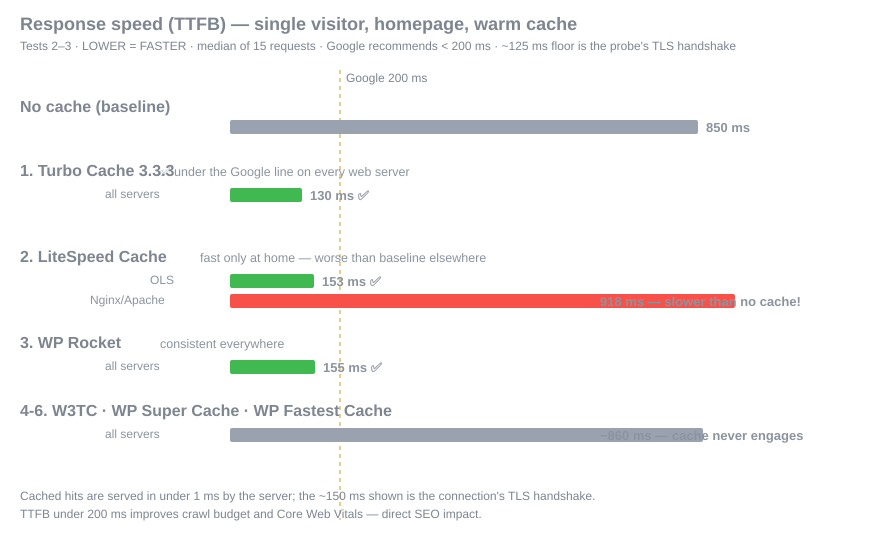

# WordPress Cache Plugin Benchmark

**🇬🇧 English** · [🇮🇷 فارسی](README.fa.md) · [🇸🇦 العربية](README.ar.md)

An open, reproducible benchmark of WordPress cache plugins on three web servers: Nginx, Apache, and OpenLiteSpeed.
Every script, configuration, and raw data point is published in this repository for independent verification.

## Test 2 — 2026-09-08

**Environment:** dedicated [VPS](https://famaserver.com/vps/) (provided by FamaServer) · 4 vCPU Intel Xeon Gold 6138 · 8 GB RAM · 40 GB NVMe (fio-verified: 87.9k IOPS) · Ubuntu 24.04 LTS · PHP 8.2 FPM (12 workers, identical on every stack) · MariaDB 10.11 · Redis · HTTPS/HTTP-2 · WordPress 7.1 + WooCommerce 9.9.5 + Woodmart 8.2.6 + Elementor — **830 products, 109 posts, 234 orders**. Load: k6, 50 concurrent users × 60 s × 3 runs, medians reported. [Full methodology →](results/)

### Plugins under test

| # | Plugin | Version | Type |
|---|---|---|---|
| 1 | [Turbo Cache](https://www.zhaket.com/web/turbo-plugin) | 3.2.4 | commercial |
| 2 | LiteSpeed Cache | 7.9.1 | free |
| 3 | WP Rocket | 3.18.3 | commercial |
| 4 | W3 Total Cache | 2.10.6 | free |
| 5 | WP Super Cache | 3.1.3 | free |
| 6 | WP Fastest Cache | 1.5.1 | free |
| 7 | Cache Enabler | 1.8.16 | free |
| 8 | WP-Optimize | 4.6.1 | free |

Auxiliary (not a page cache, evaluated separately in the cold-cache scenario): Cache Warmer 1.3.10.

### Results — requests/second at 50 concurrent users (warm cache)

| Plugin | Nginx | Apache | OpenLiteSpeed | Caches on every server |
|---|---|---|---|---|
| **Turbo Cache 3.2.4** | **192.7** | **191.3** | **194.4** 🏆 | ✅ |
| LiteSpeed Cache | 6.4 ⚠️ | 6.4 ⚠️ | 194.9 | ✖ |
| WP Rocket | 193.3 | 190.9 | 192.9 | ✅ |
| Cache Enabler | 191.9 | 189.9 | 192.3 | ✅ |
| W3 Total Cache | 6.5 | 6.5 | 6.5 | ✖ |
| WP Super Cache | 6.5 | 6.5 | 6.5 | ✖ |
| WP Fastest Cache | 6.5 | 6.5 | 6.5 | ✖ |
| WP-Optimize | 5.4 ⚠️ | 5.4 ⚠️ | 5.4 ⚠️ | ✖ |
| *(no cache)* | *7.4* | *7.3* | *7.3* | — |

⚠️ slower than running no cache plugin at all. The ~6 figures mean the plugin's page cache does not engage until manually configured.

### What the tests prove

1. **Turbo Cache is the only plugin in the top tier on all three web servers**: a statistical tie with WP Rocket on Nginx/Apache (192.7 vs 193.3 / 191.3 vs 190.9) and with LiteSpeed Cache on OpenLiteSpeed (194.4 vs 194.9) — ahead of WP Rocket there (192.9).
2. **Turbo Cache is the only plugin with a native LiteSpeed server-cache integration besides LiteSpeed Cache itself** (verified miss→hit cycle with Turbo Cache's own `x-litespeed-tag: turbo_*` tags). WP Rocket has no such integration; LiteSpeed Cache outside LiteSpeed servers is pure overhead (13% slower than no plugin).
3. **Warm TTFB ~161 ms on every web server** — under Google's 200 ms recommendation, with direct impact on crawl budget and Core Web Vitals.
4. Cache hits are served by a pre-WordPress drop-in engine (`x-turbo-cache-engine: dropin`), introduced in 3.2.4 — the Nginx/Apache throughput jumped ×15.7 over 3.1.3.
5. Of the eight plugins, only three cache out of the box: Turbo Cache, WP Rocket, Cache Enabler. The rest ship with page caching disabled (or, for WP-Optimize, add measurable overhead while disabled).

### Progress tracking

Each plugin update gets re-tested under the identical protocol; growth is charted test-over-test.

| Test | Date | Changes | Turbo Cache (Nginx / Apache / OLS) | Status |
|---|---|---|---|---|
| Test 1 | 2026-09-08 | initial — Turbo Cache 3.1.3 | 12.3 / 12.2 / 193.9 RPS | ✅ tag `test-1` |
| **Test 2** | 2026-09-08 | Turbo Cache 3.2.4 drop-in engine; +Cache Enabler, +WP-Optimize | **192.7 / 191.3 / 194.4 RPS** | ✅ tag `test-2` |
| Test 3 | TBD | enabled-settings runs for the disabled-by-default plugins, purge scenario, external load generator, 200/500 users, front-end round | — | 🔜 |

Full per-plugin reports & raw data: [`results/`](results/) · Reproduce: [`scripts/`](scripts/) · License: MIT (scripts), CC BY 4.0 (data)
